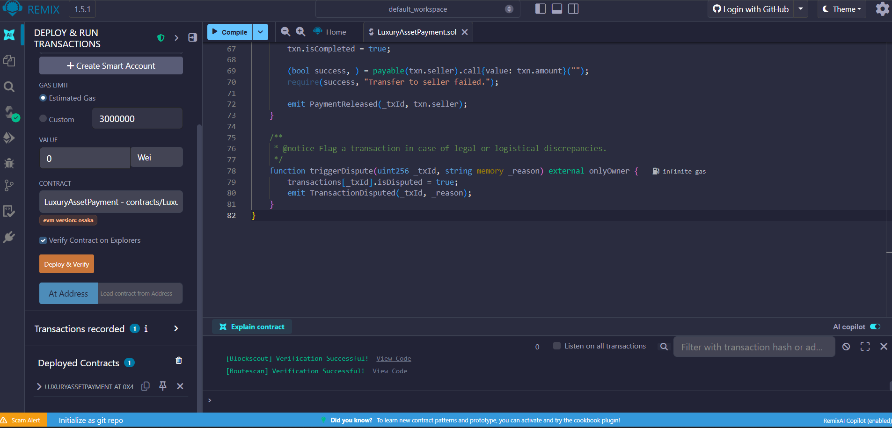
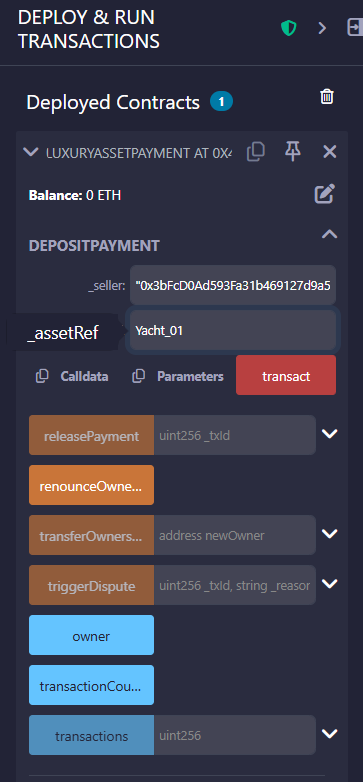
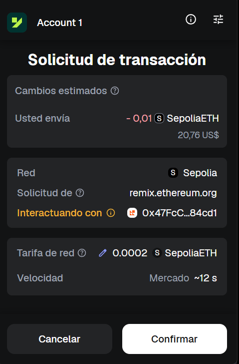

# 🚀 Luxury Asset Escrow System

This project features a **Solidity smart contract** designed for high-value asset transactions (e.g., luxury yachts or real estate). It ensures trust between buyers and sellers by holding funds in escrow until the delivery is confirmed.

### 🛠 Technical Stack
* **Language:** Solidity
* **Environment:** Remix IDE
* **Network:** Ethereum Sepolia Testnet
* **Wallet:** MetaMask

## 🔗 Blockchain Proof (Live Demo)
The contract and its lifecycle can be verified on Etherscan:

1. **Smart Contract Address:** [0x47FcC1aE8De00ab6500dfBD299C355b8B0c84cd1](https://sepolia.etherscan.io/address/0x47fcc1ae8de00ab6500dfbd299c355b8b0c84cd1)

2. **Contract Deployment:** [View Successful Deployment](https://sepolia.etherscan.io/tx/0xf2f0f4a211847e761623916962f928a306c599903932e67df1441a50a1230d59)

3. **Secure Deposit (Escrow Locked):** [View Deposit for "Yacht_01"](https://sepolia.etherscan.io/tx/0x6fb35134242111193132e0388997991041169548492d594586d1f76f7f32d4bc) 
   *(Note: This transaction confirms the asset registration in the escrow system.)*

4. **Successful Release (Final Payout):** [View Final Payment](https://sepolia.etherscan.io/tx/0x78591e2ddb0dc2ea3a46c2397dab68261f5a004e1722576085f56e2ffbe7b625)
   *(Note: This confirms the final state change and successful contract execution.)*

## 📸 Technical Implementation & Proof
Below is a step-by-step visual walkthrough of the deployment and execution phases.

### 1. Contract Deployment & Verification
The contract was developed using the Remix IDE. Successful source code verification on Blockscout and Routescan ensures full transparency and public auditability.

### 2. Initiating the Escrow (Deposit)
To start a transaction for **"Yacht_01"**, the buyer calls the `depositPayment` function. This registers the seller's address and the asset identifier within the immutable ledger.

### 3. Web3 Wallet Interaction (Authorization)
All transactions require secure authorization. Every state change on the blockchain is cryptographically signed and secured via MetaMask.

### 4. Finalized Transaction State
After the payment release, the contract state is updated. The decoded output confirms:
* **`isCompleted: true`**: Funds successfully transferred to the seller.
* **`isDisputed: false`**: Transaction finalized smoothly without discrepancies.
* **`assetIdentifier`**: Correctly mapped to "Yacht_01".

